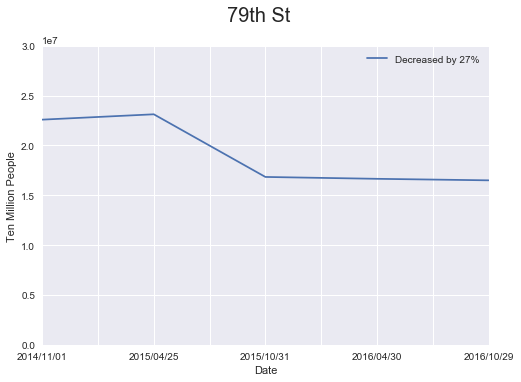
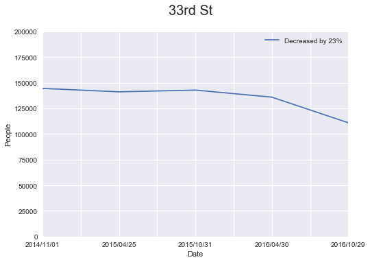
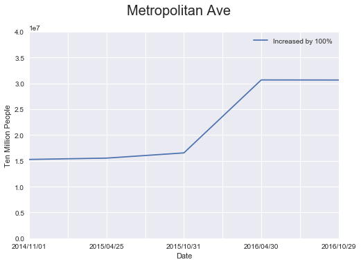
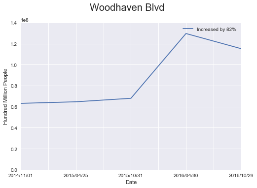
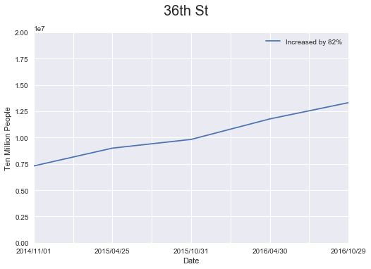

This week I have been fluctuating among being overwhelmed, frustrated, fulfilled... There's so much to learn and to do everyday: pair programming problems, lectures, projects... all happening concurrently!

We've finished our first group project today, for which we used the NYC MTA turnstile data to analyze and describe ridership patterns and pitched to the "imaginary" MTA for better allocating budgets by cutting operational costs and expanding services accordingly.

We pulled two data files each year for the past two and half years. After cleaning, grouping and merging, we collected 186 stations with 2174 turnstiles in total. We aggregated all the turnstile data by station and generated the percentage change over the period and sorted them.

When we looked at the sorted data, we saw some implausible ones, like a station that has a hundred thousand times of ridership increase or almost a hundred percent decrease, so we made some subjective judgements when selecting the ones to present. First, the change should be generally consistent; if there’s an unreasonable spike or slump and falls back again, it may not be reliable (could be due to systematic issues). Second, the change should make a relatively big impact in terms of the base number; if the base number is ten thousand, then even if it changed by 50%, it probably wouldn’t make much of a difference, where as if the base number is a hundred million, then even 10% of change could be a significant change. Here are the two samples we presented.

**Stations with Declining Ridership over Time**

1. Prospect Park
2. Hoyt St.
3. 79th St.
4. 33rd St.

**Stations with Increasing Ridership over Time**
 
1. Metropolitan Ave.
2. Woodhaven Blvd.
3. 36th St.
4. 34th St. - Herald Sq.

 

Ridership pattern analysis enables MTA to make better operational and managerial decisions with minimum service disruption, such as train frequency, bus route support, or service cutback.
