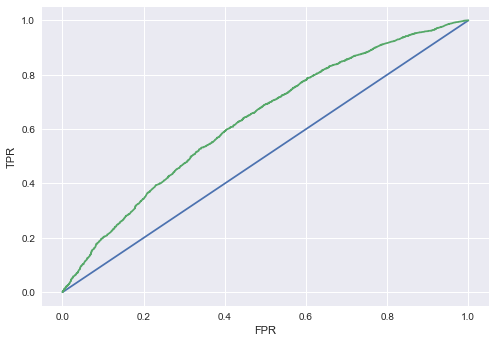
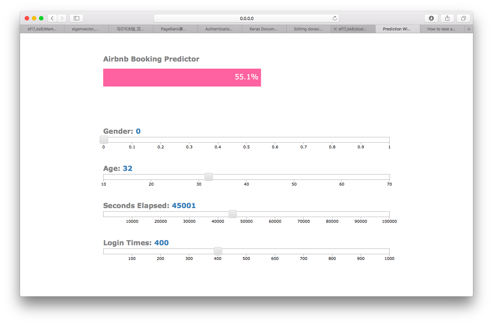

The third project was about predicting Airbnb user booking, for which I incorporated supervised learning as well as the web app tool Flask.

The dataset was acquired from Airbnb New User Booking on Kaggle. The original objective was to predict which country a user will first visit, but I turned it to whether a user is going to book or not. I used four features: gender, age, seconds elapsed and login count. I only ended up with four because I assumed that the other features wouldn't be useful.

I chose Gradient Boosting model to do the classification, primarily because it performed the best among all the models I tried, such as Random Forest, Linear Regression, SVM, etc. With a Dummy Classifier, the precision rate is 52%, which means that 52% of the users did book. After tuning the thresholds from 0.01 to 0.09, the precision was boosted from 59% to 65%, but the recall slumped from 69% to 32%. I prefered a high precision because ideally, at a high threshold, the false positives resemble the true positives to a large extent, meaning that they are of great value in terms of research and conversion, hence I have to be highly confident and control the number of false positives. Say, if some users are highly likely to book, but still bailed, Airbnb could conduct specific research on them and they might be more easily converted to real bookers than random non-bookers.

Here is the image of the ROC curve. The AUC was lifted to 0.63.

And here is a screenshot of my Flask web app. Didn't know how to change the gender to a categorical variable...

My takeaway is that I should have adopted more features instead of throwing them away based on my assumption. I arbitrarily
assumed that they are not relevant to the classification so I ditched them in the first place, which resulted in a lack of
good features and a not very accurate model. I also should have saved the final data frame locally once created, because
otherwise I would have to run the entire code to get the data frame if something was messed up, which happened a lot and was pretty time-consuming.
